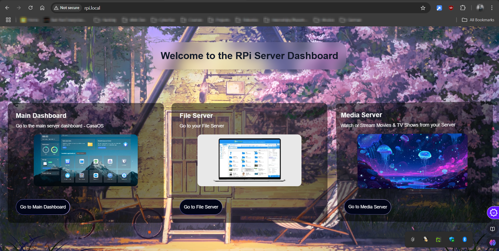

# Home Server Dashboard 🌐

Welcome to the **Home Server Dashboard**, a central landing page for managing and accessing your home server. This directory is to set the landing page of your server, for users when they access the server.

## Features 🚀

- **Main Dashboard**  
  Quickly navigate to the `CasaOS` main server dashboard for overall system management.

- **File Server**  
  Access, upload, and manage your files effortlessly.

- **Media Server**  
  Stream movies, TV shows, and music from your server with ease.

- **Live Wallpapers**  
  Implemented live wallpapers based on the time.

## Preview 🎨



## Technologies Used 🛠️

- **Frontend**: [Next.js](https://nextjs.org/)
- **Components**: [Aceternity UI](https://ui.aceternity.com/)
- **Hosting Tool**: [Nginx](https://nginx.org/en/)
- **Backend Storage**: Raspberry Pi with external HDD/SSD

## Installation Guide 📦

### Prerequisites
1. Your Server

### Steps
1. Clone this repository to your Raspberry Pi:
   ```bash
    ```